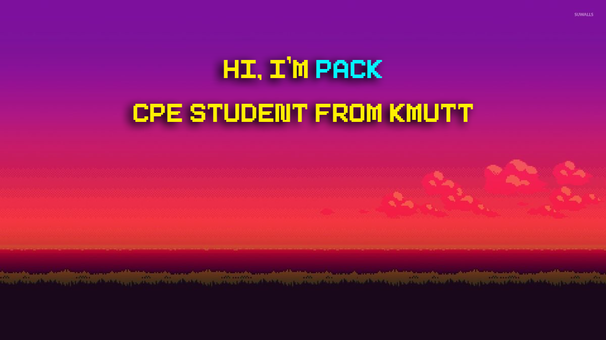

  

My name is Aussadawut Ardrit 😎, a 3rd year student in Computer Engineering from King Mongkut's University of Technology Thonburi 💻. I'm interested in new technologies, web development, and cyber security 💪. And now, I'm currently studying at 42Bangkok 🐱

<h2 align="center">Technology Stack</h2>

      

<h2 align="center">Current Stats</h2>

<!--

-->

<h2 align="center">Current 42Bangkok Projects</h2>

|  Rank  | Project name     | Status |
| :----: | ---------------- | :----: |
|   0    | Libft            |   ⭐   |
|   1A   | get_next_line    |   ⭐   |
|   1B   | ft_printf        |   💻   |
|   1C   | Born2beRoot      |   💻   |
| **2A** | **Exam_rank_02** |   🔒   |

⭐ = Mandatory part + Bonus part || ✅ = Only Mandatory part || 💻 = Still coding || 🔒 = Lock

<!--
**PackHubTH/PackHubTH** is a ✨ _special_ ✨ repository because its `README.md` (this file) appears on your GitHub profile.

Here are some ideas to get you started:

- 🔭 I’m currently working on ...
- 🌱 I’m currently learning ...
- 👯 I’m looking to collaborate on ...
- 🤔 I’m looking for help with ...
- 💬 Ask me about ...
- 📫 How to reach me: ...
- 😄 Pronouns: ...
- ⚡ Fun fact: ...
  -->
